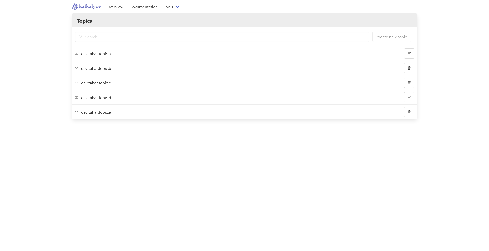
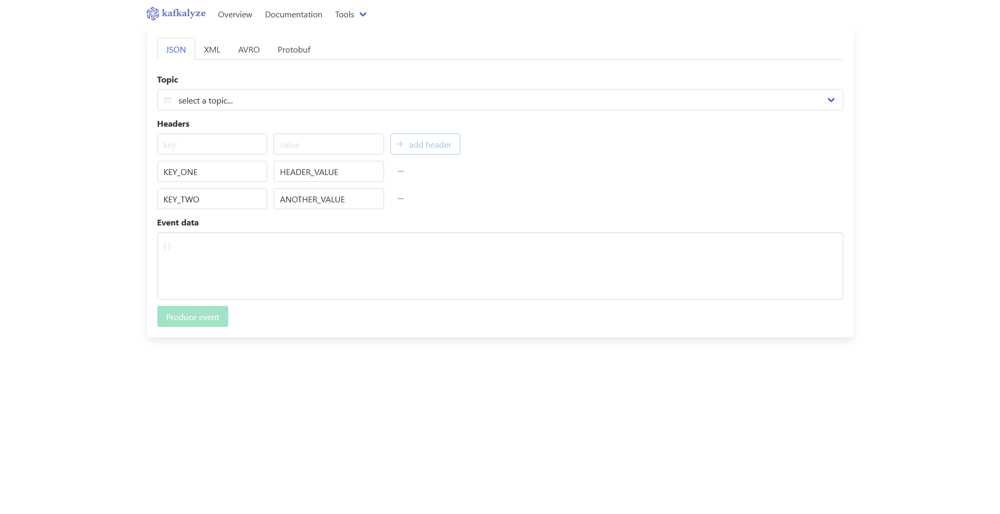

# Kafkalyze
Welcome to the Kafkalyze project!
We're creating a one-stop-shop for all your Kafka debugging needs.

Ever found yourself working on a complex microservice application and wanting to gain more insight into *what* is produced to Kafka?

Maybe you'd like to see the exact event data that was produced so you can figure out why your consumer failed?

Or perhaps your application freezes sometimes and you can't reproduce the issue because you don't have the exact order in which events where produced?

Fear not! Kafkalyze can help with just that!
Kafkalyze levels up a developer's productivity by providing them with advanced insights into the data that was produced on the cluster.

We're not just talking about infrastructure-related statistics, we're talking about the data *you* as a developer need to do what you do best: create amazing applications! Think of raw events, topic consumers, and much more!

## Showcase
### List all topics on a Kafka broker

### Produce raw event data to any given topic

## Installation
Once the project matures, everything will be distributed as a Docker image.

For now, you can just compile the application and run it like any other Java application.
To make it easier to set up all required infrastructure, a Docker Compose file has been provided in the `/server` directory.

Run `docker compose -f docker-compose-local.yaml up -d` from the root folder to start the stack.

To stop the stack, simple run `docker compose -f docker-compose-local.yaml stop` from the root folder.
